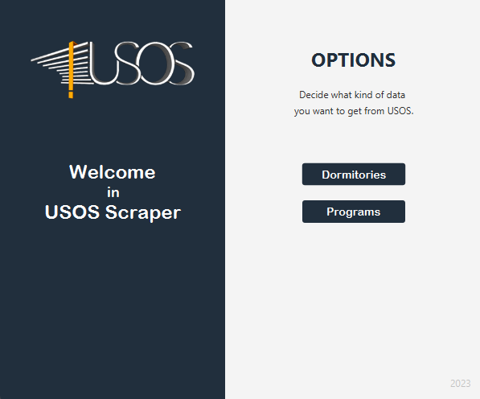

# USOS Scraper
> This app was created for the purpose of completing the Java course.

The application is used to download data from the USOS website of the University of Lodz regarding:
- dormitories
- majors and study programmes

The data is saved to the Files folder in the form of .csv files.

## Technologies

- [Java](https://www.java.com/pl/) (v19.0.1) - Java language
- [Maven](https://maven.apache.org/) (v3.9.0) - build automation tool and package manager
- [JavaFX](https://openjfx.io/) (v19.0.2.1) - authentication middleware for Node.js

# Usage 
> Project was developed in Intellij Idea and the instruction is for running it in this environment

1. Clone/pull repository
2. Open project in Intellij Idea
3. Go to *./src/main/java/com.example.scraperGUI/HelloApplication* and run this file.

## License

All code is released under the MIT License.

